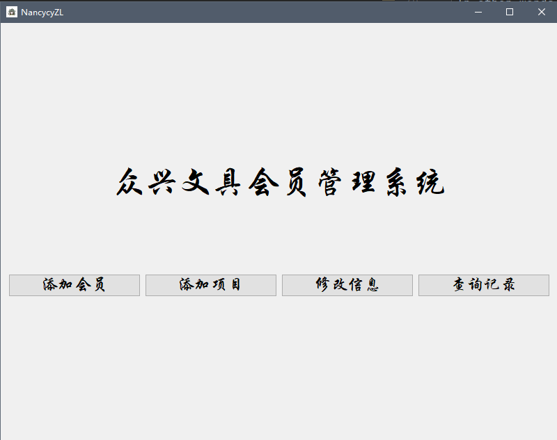
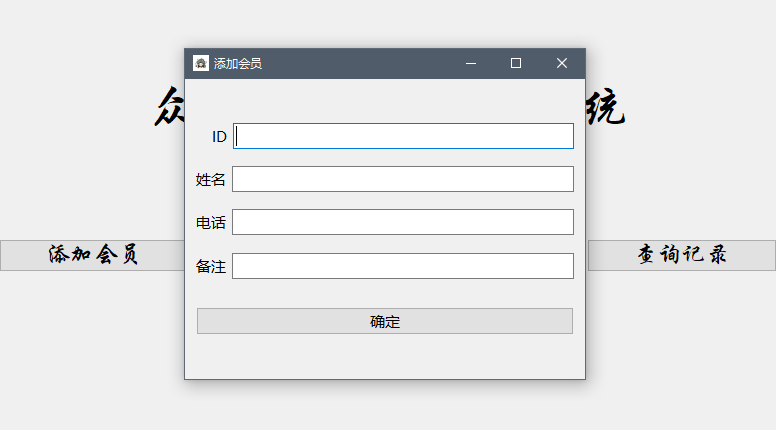
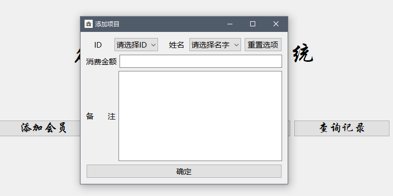
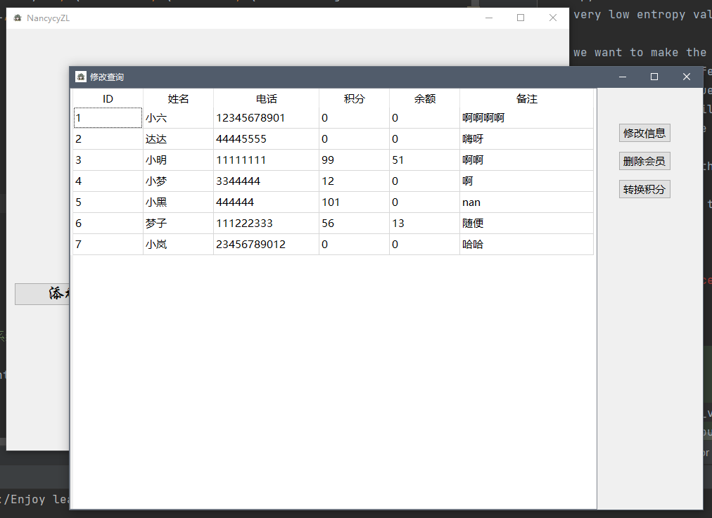
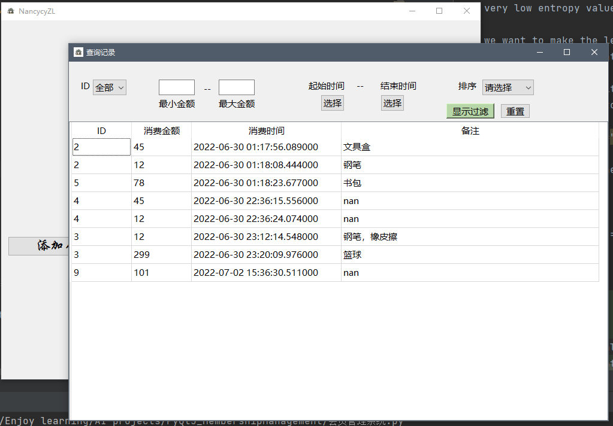
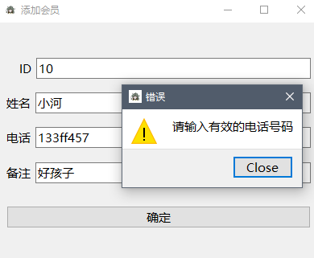
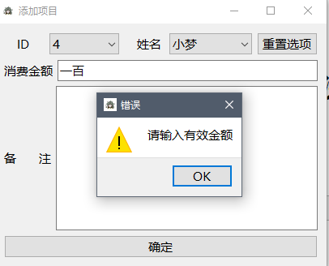
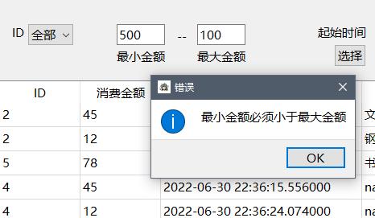
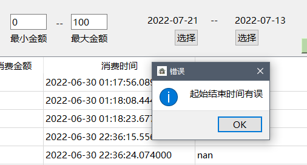

Membership Management System with PyQt5
---------------------------------------

This is a mini project of creating a self-used graphic user interface for membership management using PyQt5.
Basically the program provides functions for viewing and editing member's information.

Watch demo video [here](https://youtu.be/gPq2NIfvZGk)

 
All the data is simply stored in excel files, as this project is focused on PyQt5 so
there is no need to build a complicated database system.

The 2 excel files included are:  

>会员信息.xlsx: storing member id, name, phone number, points, remaining and remarks  
>消费条目.xlsx: storing member id, amount spent, date and remarks

Just a side note that, *points* and *remaining* here are related to a specific function
in our membership management system. We adopt a cumulative point system for the benefits of membership.
1 RMB is equivalent to 1 point and members can get a RMB20 voucher upon an accumulation of 100 points.
*Points* refers to the accumulated points, and *remaining* refers to the remaining amount in the voucher.

 

The GUI contains a main window and 4 sub-windows for each of the bellowing functions:
> 添加会员: add new member(s) to the system   
> 添加项目: add new record when a member comes to consume    
> 修改信息: change certain information, like change name/phone number, or delete a member   
> 查询记录: view all records, supported by filtering and sorting functions  

Below is a preview of each of these 4 sub-windows.

#### Add new member

#### Add new record

#### Check and modify member information 

#### Check records

  
The program also integrates error checking for user inputs before saved into excel files.
This is to prevent the GUI from quiting itself without showing any error message, and making the system more robust.
For example, the program will check whether phone number is valid, whether consumption amount is valid,
whether start date and end date for filtering is valid, etc. The following shows some examples of error:

#### Example 1: invalid phone number because it contains alphabets

#### Example 2: invalid consumption amount because only numbers are accepted for this input

#### Example 3: incorrect min and max consumption amount set by user for filtering

#### Example 4: incorrect start and end date set by user for filtering

